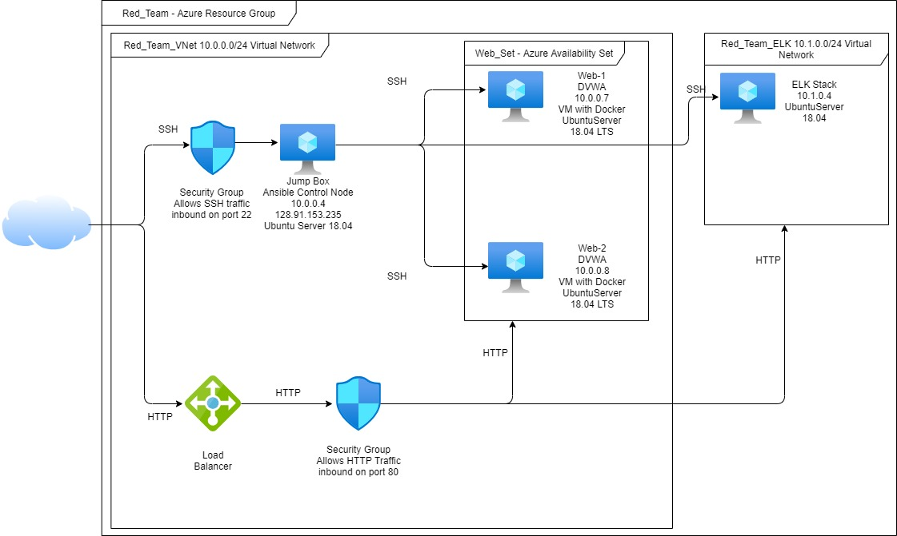
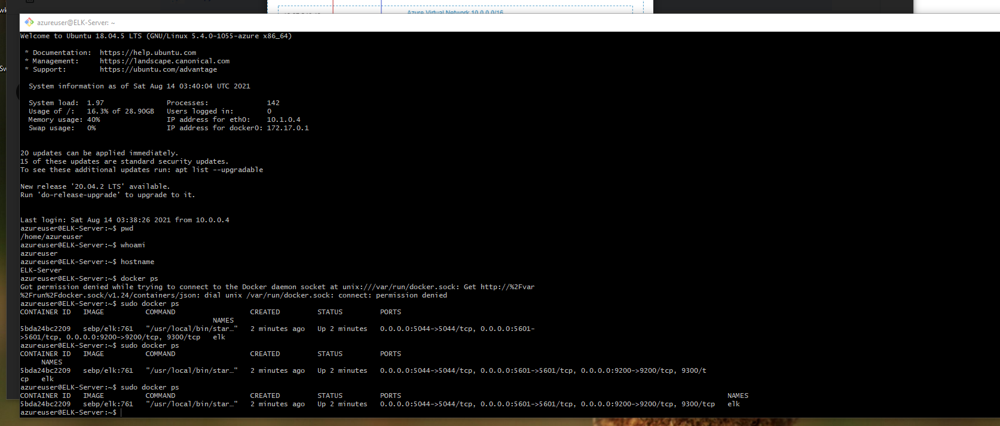
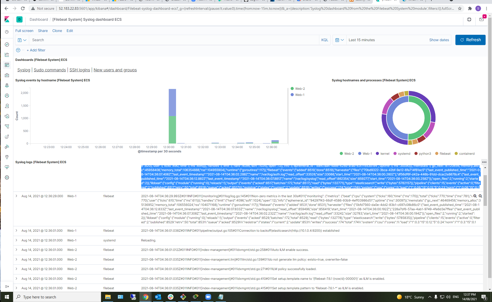
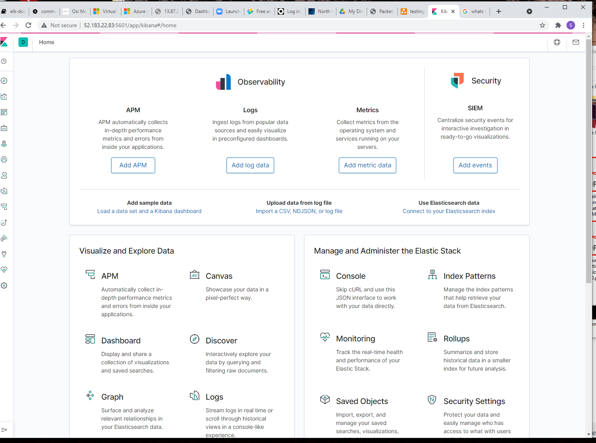

## Automated ELK Stack Deployment

The files in this repository were used to configure the network depicted below.



These files have been tested and used to generate a live ELK deployment on Azure. They can be used to either recreate the entire deployment pictured above. Alternatively, select portions of the playbook file may be used to install only certain pieces of it, such as Filebeat.

[FileBeat_Ansible.yml](Resources/FileBeat_Ansible.yml)

This document contains the following details:
- Description of the Topology
- Access Policies
- ELK Configuration
  - Beats in Use
  - Machines Being Monitored
- How to Use the Ansible Build


### Description of the Topology

The main purpose of this network is to expose a load-balanced and monitored instance of DVWA, the D*mn Vulnerable Web Application.

Load balancing ensures that the application will be highly available, in addition to restricting traffic to the network. Load balancers protects the system from DDoS attacks by shifting attack traffic. The advantage of a jump box is to give access to the user from a single node that can be secured and monitored.

Integrating an ELK server allows users to easily monitor the vulnerable VMs for changes to the logs and system metrics.

The configuration details of each machine may be found below.

| Name       | Function | IP Address | Operating System          |
|------------|----------|------------|---------------------------|
| Jump Box   | Gateway  | 10.0.0.4   | Linux Ubuntu Server 18.04 |
| Web-1      | DVWA VM  | 10.0.0.7   | Linux Ubuntu Server 18.04 |
| Web-2      | DVWA VM  | 10.0.0.8   | Linux Ubuntu Server 18.04 |
| ELK-Server | ELK VM   | 10.1.0.4   | Linux Ubuntu Server 18.04 |


### Access Policies

The machines on the internal network are not exposed to the public Internet. 

Only the Jump Box machine can accept connections from the Internet. Access to this machine is only allowed from the following IP addresses:
- HomeIP

Machines within the network can only be accessed by SSH (port 22) from the Jump Box.
- 10.0.0.4

A summary of the access policies in place can be found in the table below.

| Name       | Publicly Accessible | Allowed IP Address(es) |
|------------|---------------------|------------------------|
| Jump Box   | Yes                 | HomeIP                 |
| Web-1      | No                  | 10.0.0.4               |
| Web-2      | No                  | 10.0.0.4               |
| Elk-Server | Yes                 | 10.0.0.4 and HomeIP    |


### Elk Configuration

Ansible was used to automate configuration of the ELK machine. No configuration was performed manually, which is advantageous because multiple commands can be run across multiple machines from a single configuration playbook.

The playbook implements the following tasks:
- Install: docker.io
- Install: python-pip
- Install: Docker
- Command: sysctl -w vm.max_map_count=262144 (Changes the memory settings on the ELK VM)
- Launch docker container: ELK

The following screenshot displays the result of running `docker ps` after successfully configuring the ELK instance.




### Target Machines & Beats

This ELK server is configured to monitor the following machines:
- Web-1 DVWA VM 10.0.0.7
- Web-2 DVWA VM 10.0.0.8

We have installed the following Beats on these machines:
- filebeat
- metricbeat

These Beats allow us to collect the following information from each machine:
- filebeat collects logs: information such as how many visitors and their location, or errors such as 404 or 503 and why they happened.

- metricbeat: provides metrics logs such as CPU and memory usage   


### Using the Playbook

In order to use the playbook, you will need to have an Ansible control node already configured. Assuming you have such a control node provisioned: 

SSH into the control node and follow the steps below:
- Copy the FileBeat_Ansible.yml file to /etc/ansible.

```	
$cd /etc/ansible
$git clone https://github.com/Brindamour76/ElkStackProject.git
$cp ElkStackProject/Resources/* .
```

- Update the hosts file to include the private IP addresses of the machines you wish to install and configure ELK.

```
$cd /etc/ansible
$nano hosts	 
```

Add the following:

```	
[webservers]
10.0.0.7 ansible_python_interpreter=/usr/bin/python3	
10.0.0.8 ansible_python_interpreter=/usr/bin/python3

[elk]
10.1.0.4 ansible_python_interpreter=/usr/bin/python3
```

- Run the playbook, and navigate to the public IP address of the ELK-VM:5601 to check that the installation worked as expected.

```	
$cd /etc/ansible
$ansible-playbook ELKBeats.yml elk
$ansible-playbook FileBeat_Ansible.yml webservers
$ansible-playbook MetricBeat_Ansible.yml webservers
``` 



